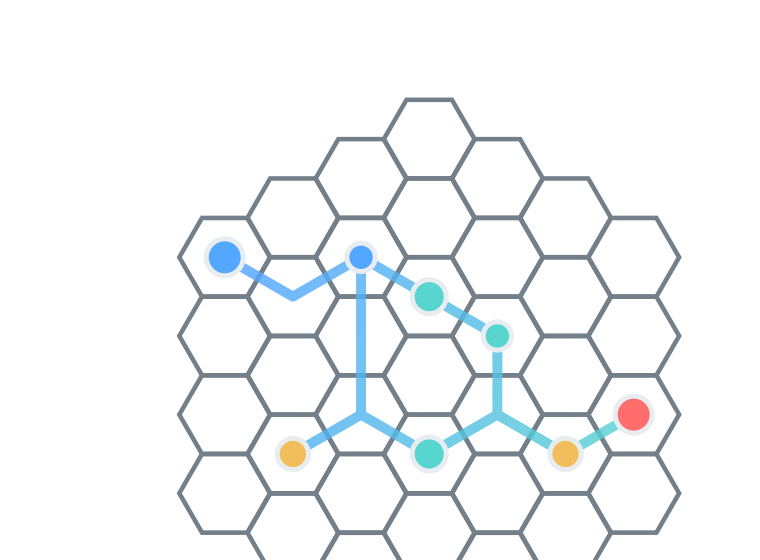
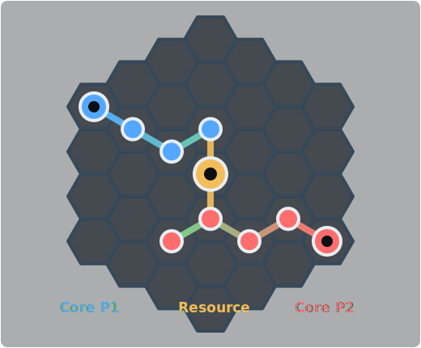
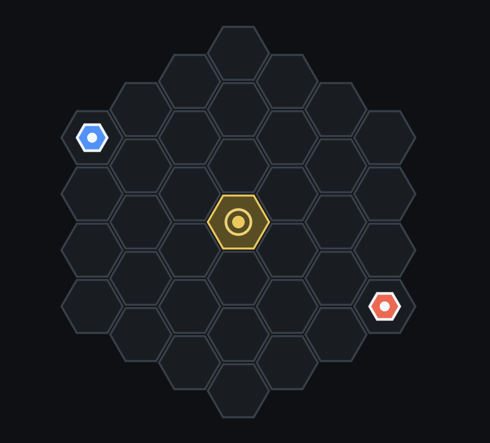
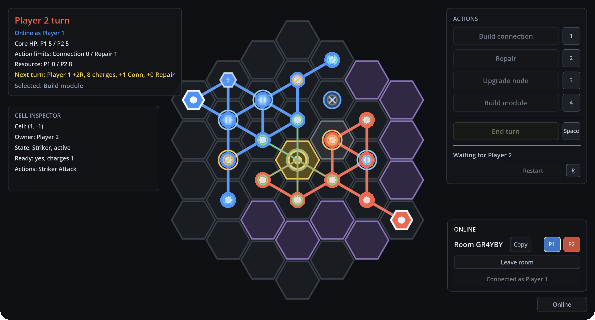

<!-- _class: lead -->

Проектная работа

# Hollow Grid

Пошаговая multiplayer strategy game на hex-grid: Godot-клиент, TypeScript WebSocket-сервер и браузерный запуск.

  Godot Web
  Node.js
  WebSocket
  TypeScrip

---

## Актуальность проекта

  

    <h3>Практика реальной разработки</h3>
    <ul>
      <li>клиент и сервер как отдельные части системы;</li>
      <li>сетевое взаимодействие через WebSocket;</li>
      <li>проверка правил на сервере, а не только на клиенте.</li>
    </ul>
  

  

    <h3>Почему игра подходит для демонстрации</h3>
    <ul>
      <li>видимый результат в браузере;</li>
      <li>есть алгоритмическая часть: поле, ходы, валидация;</li>
      <li>можно показать архитектуру, тесты и сборку.</li>
    </ul>
  

---

## Цель и задачи

  

    <h3>Цель</h3>
    
Создать рабочий прототип сетевой пошаговой стратегии, которую можно запустить в браузере и протестировать локально.

  

  

    <h3>Задачи</h3>
    <ul>
      <li>описать правила матча и игровое состояние;</li>
      <li>реализовать Godot-клиент с hex-полем и HUD;</li>
      <li>создать WebSocket-сервер комнат;</li>
      <li>покрыть серверную логику тестами;</li>
      <li>подготовить web-preview через Docker/nginx.</li>
    </ul>
  

---

## Идея игры Hollow Grid

  

    
<strong>Hollow Grid</strong> — тактическая игра про развитие сети от своего <code>Core</code> на hex-grid поле.

    <ul>
      <li>игроки расширяют сеть узлов;</li>
      <li>перекрывают маршруты соперника;</li>
      <li>улучшают узлы под экономику, защиту и атаку;</li>
      <li>побеждают, уничтожив вражеский <code>Core</code>.</li>
    </ul>
  

  

    
  

---

## Правила и игровое поле

  

    

      

        37
        клеток на hex-grid радиуса 3
      

      

        2
        игрока в основном online-режиме
      

      

        5 HP
        у каждого Core в базовой настройке
      

    

    

      <ul>
        <li>каждый ход активный игрок строит, восстанавливает, улучшает или завершает ход;</li>
        <li>сеть активна только если связана с собственным <code>Core</code>;</li>
        <li>сервер проверяет очередность, владельца действия и допустимость клетки.</li>
      </ul>
    

  

  

    
  

---

## Архитектура проекта

  

    <h3>Godot-клиент</h3>
    <ul>
      <li>отрисовка hex-grid;</li>
      <li>HUD и ввод игрока;</li>
      <li>Web export в браузер;</li>
      <li>WebSocketPeer для сети.</li>
    </ul>
  

  
WS JSON

  

    <h3>TypeScript-сервер</h3>
    <ul>
      <li>комнаты и слоты игроков;</li>
      <li>авторитетный <code>MatchState</code>;</li>
      <li>валидация публичных действий;</li>
      <li>broadcast полного snapshot.</li>
    </ul>
  

---

## Сетевой flow

  

    <b>create room</b>
    первый клиент получает <code>room_code</code>, <code>player_1</code> и начальный snapshot
  

  

    <b>join room</b>
    второй клиент подключается по коду и получает свободный слот игрока
  

  

    <b>action</b>
    клиент отправляет typed envelope с игровым действием
  

  

    <b>snapshot</b>
    после принятого действия сервер рассылает полное состояние матча
  

  
<code>create_room</code>, <code>join_room</code>, <code>action</code>, <code>snapshot</code>, <code>presence_updated</code>, <code>error</code>

---

## Практическая реализация

  

    <h3>Клиент</h3>
    <ul>
      <li><code>main.gd</code> управляет режимами игры;</li>
      <li><code>board_view.gd</code> отвечает за поле;</li>
      <li><code>network_client.gd</code> отправляет и принимает JSON-сообщения;</li>
      <li><code>hud.gd</code> показывает HP, ресурсы и статус.</li>
    </ul>
  

  

    <h3>Сервер</h3>
    <ul>
      <li><code>hollowGridServer.ts</code> держит комнаты и WebSocket-сессии;</li>
      <li><code>matchState.ts</code> применяет правила;</li>
      <li><code>gameAction.ts</code> разбирает и валидирует действия;</li>
      <li><code>messages.ts</code> фиксирует сетевой контракт.</li>
    </ul>
  

---

## Тестирование и сборка

  

    <code>$ cd server</code>
    <code>$ npm test</code>
    <code class="ok">3 test files passed</code>
    <code class="ok">20 tests passed</code>
     
    <code>$ npm run build</code>
    <code class="ok">TypeScript compile OK</code>
  

  

    

      <h3>Правила матча</h3>
      
<code>matchState.test.ts</code>: начальный snapshot, очередность ходов, upkeep, ресурсы, роли узлов, атаки, взлом и завершение игры.

    

    

      <h3>Контракт действий</h3>
      
<code>gameAction.test.ts</code>: публичные действия принимаются, некорректные формы отклоняются, внутренние команды не проходят в transport.

    

    

      <h3>Сетевой сценарий</h3>
      
<code>websocket.test.ts</code>: healthcheck, create/join room, reconnect, full-room errors, player ownership и broadcast snapshot.

    

  

---

<!-- _class: demo-slide -->

## Демонстрация запуска в браузере

  
Web preview: <code>scripts/web-up.sh</code> → <code>http://127.0.0.1:8080/</code>

  
Godot Web клиент подключается к <code>/ws</code>

  

---

## Выводы

  

    <h3>Что получилось</h3>
    <ul>
      <li>прототип пошаговой стратегии с online flow;</li>
      <li>разделение клиента, сервера и документации;</li>
      <li>серверная валидация действий и снимки состояния;</li>
      <li>локальный browser preview через Docker.</li>
    </ul>
  

  

    <h3>Что показал проект</h3>
    <ul>
      <li>как связать игровой движок и backend;</li>
      <li>как проектировать сетевой протокол;</li>
      <li>как тестировать критичную игровую логику.</li>
    </ul>
  

---

## Дальнейшее развитие

  

    <h3>Игровые механики</h3>
    <ul>
      <li>баланс ролей <code>Harvester</code>, <code>Striker</code>, <code>Defender</code>, <code>Hacker</code>;</li>
      <li>новые карты, resource points и hazard cells;</li>
      <li>улучшенная визуальная обратная связь по действиям.</li>
    </ul>
  

  

    <h3>Техническая часть</h3>
    <ul>
      <li>лобби и список активных комнат;</li>
      <li>наблюдатели и reconnect-поведение;</li>
      <li>больше e2e-проверок браузерного flow;</li>
      <li>production deploy и мониторинг.</li>
    </ul>
  

Hollow Grid: Godot + Node.js + WebSocket

